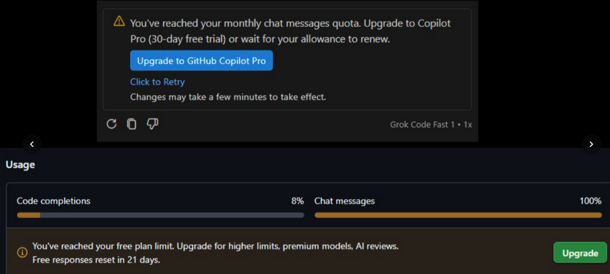
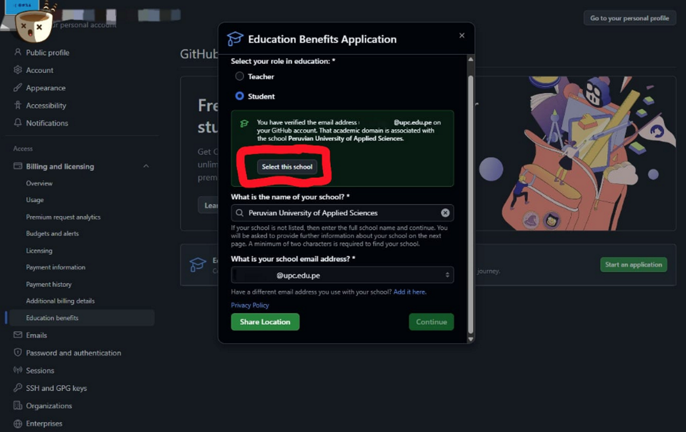
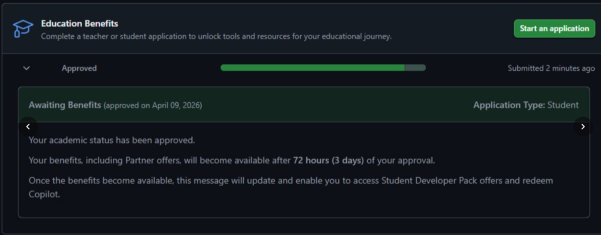
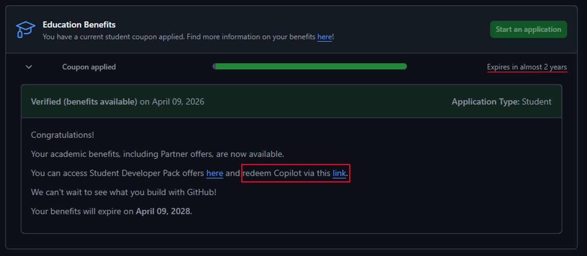
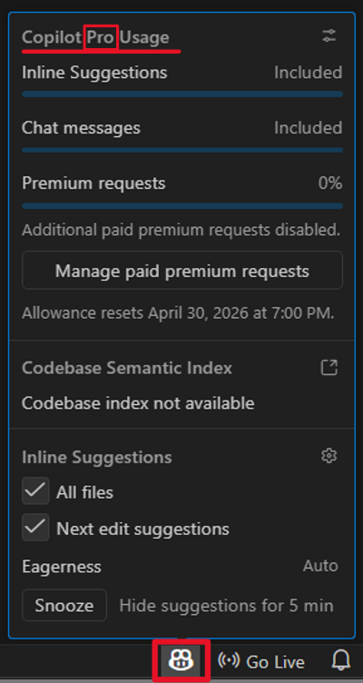
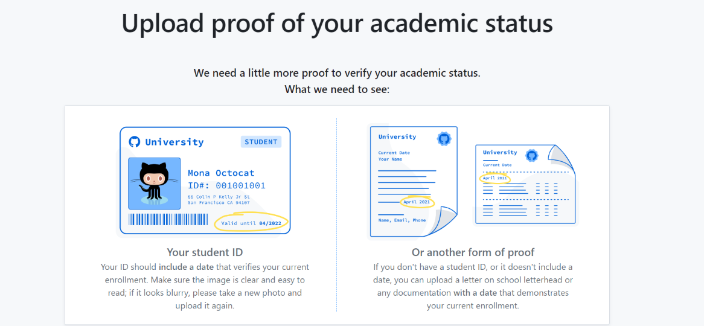
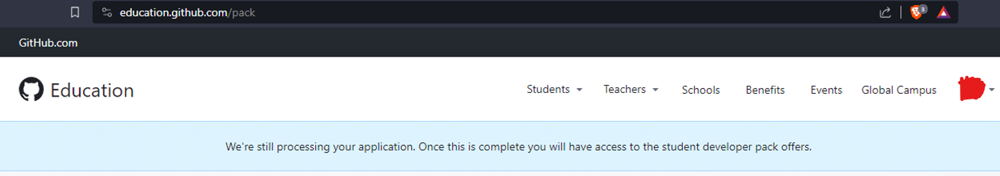

# Introducción

Para reclamar GitHub Copilot para estudiantes, sigue estos pasos:

# Forma actual (abril-2026)

1. Cuando se agoten los tokens del plan gratuito de GitHub Copilot, verás un aviso. Sin embargo, puedes actualizar al plan Pro con las credenciales de tu universidad.

2. Entra a https://github.com/settings/education/

3. Haz clic en "Select this school". Si aún no has agregado tu correo institucional a tu cuenta, añádelo y verifícalo en https://github.com/settings/emails. GitHub lo detectará automáticamente como válido al momento de aplicar. También puedes presentar tu carné universitario o una constancia de matrícula para comprobar que estás inscrito. En caso de la UPC, puedes usar el TIU de Mi UPC.

4. Luego de eso te pedirá esperar 72 horas para obtener los beneficios.

5. Una vez transcurrido ese tiempo, podrás reclamar Copilot.

6. Verifica que la membresía de GitHub Copilot esté activa en tu IDE; en este caso, VS Code.

# Forma antigua (2024)

1. [Apply to GitHub Global Campus as a student - GitHub Docs](https://docs.github.com/es/education/about-github-education/github-education-for-students/apply-to-github-education-as-a-student)
2. [Get your GitHub benefits](https://education.github.com/discount_requests/application)
3. [I am a student, can I get access to GitHub Copilot for free?](https://github.com/pricing#i-am-a-student-can-i-get-access-to-github-copilot-for-free)
4. [GitHub Student Developer Pack](https://education.github.com/pack)   

Puedes usar tu carné universitario para confirmar tu estatus académico  

5. [Primer: Codespaces](https://education.github.com/experiences/primer_codespaces)
6. [Primer: Copilot](https://education.github.com/experiences/primer_copilot)
7. [Tutorial with VSC](https://education.github.com/experiences/primer_copilot)
8. [Tutorial with VS](https://docs.github.com/en/copilot/using-github-copilot/getting-started-with-github-copilot?tool=visualstudio)