# Conexión a GitHub mediante SSH

El objetivo de esta guía es crear commits y enviar cambios desde una cuenta alternativa mediante SSH, mientras se mantiene iniciada la cuenta principal en el IDE para usar suscripciones como GitHub Copilot Pro. La cuenta del IDE, la identidad del autor de Git y la cuenta autenticada mediante SSH son configuraciones independientes.  

# Cuenta con SSH en un repositorio nuevo  
Si la cuenta y su clave SSH ya están configuradas y se quiere usar dicha cuenta en un repositorio nuevo, únicamente se deben seguir estos pasos:
1. [Recordar el alias del host](#3-configurar-sshconfig) (Paso 3).
1. [Cambiar el remote del repositorio](#4-cambiar-el-remote-del-proyecto) (Paso 4).
1. [Configurar la identidad local del repositorio](#5-configurar-la-identidad-local-del-repositorio) (Paso 5).
1. [Configurar las firmas en el repositorio](#configuración-en-el-repositorio) (Paso 6, parte 2).
 
# Tutorial desde 0
## Configuración del SSH en un dispositivo
### 1. Crear una llave SSH  
Se recomienda crear una clave SSH distinta para cada combinación de cuenta y dispositivo. No es un requisito técnico, pero permite revocar el acceso de un solo dispositivo sin afectar a los demás. En esta guía se seguirá esa recomendación.  

Para mantener privado el correo personal, se puede usar la dirección `noreply` proporcionada por GitHub. Vamos a `GitHub → Settings → Emails`, activamos `Keep my email addresses private` y copiamos la dirección mostrada. Usaremos esa dirección tanto en el siguiente comando como en `git config user.email`; así GitHub podrá atribuir los commits a la cuenta sin publicar el correo real.

Abrimos **Git Bash** y ejecutamos:

```bash
ssh-keygen -t ed25519 -C "correo_de_la_cuenta_secundaria"
```
Cuando se solicite la ruta del archivo, cambiamos el nombre predeterminado (`id_...`) al formato `id_<tipo>_<servicio>_<cuenta>_<dispositivo>`.  
En este ejemplo, `<tipo>` es `ed25519` y `<servicio>` es `github`.  
Ejemplo: 
`/c/Users/FFF/.ssh/id_ed25519_github_foo_laptopFoo`  
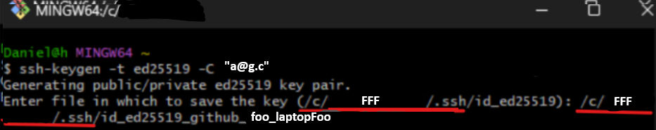


Generamos una passphrase robusta con 1Password u otro gestor de contraseñas y la guardamos allí con una referencia a la cuenta y al dispositivo. Ejemplo: `f.LF ssh`.  

Cuando Git Bash la solicite, introducimos la passphrase.    
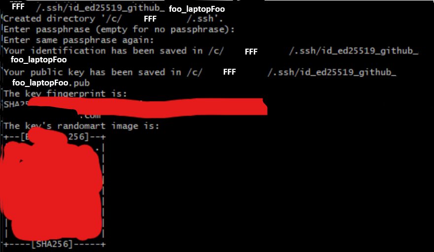

### 2. Añadir la clave pública a GitHub
Ejecutamos en **Git Bash**:  
```bash
cat ~/.ssh/id_ed25519_github_foo_laptopFoo.pub | clip  
```  
Este comando copiará la clave pública al portapapeles.  
Luego vamos a [SSH and GPG keys](https://github.com/settings/keys) o a `GitHub → Settings → SSH and GPG keys → New SSH key`.
La pegamos tal como se copió y seleccionamos *Authentication key*.
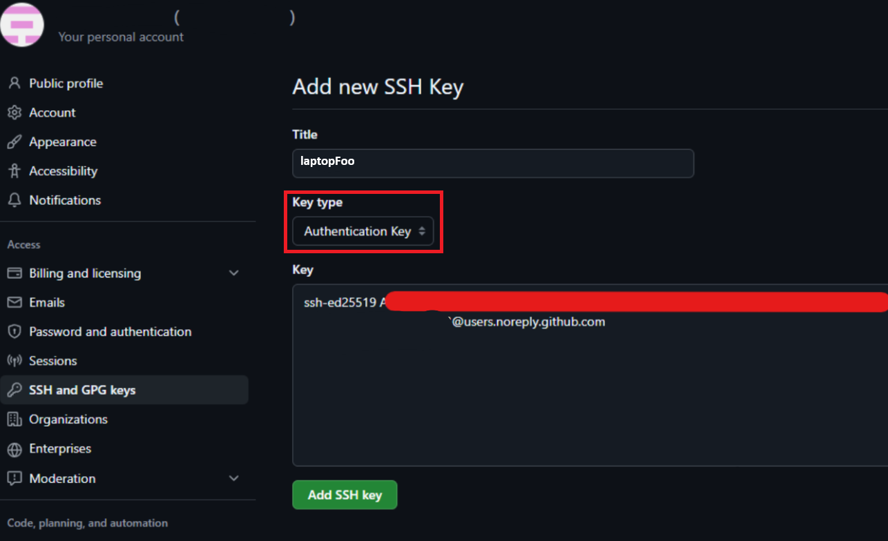  
Para simplificar el paso 6, también se puede añadir la misma clave pública como *Signing key*: hay que subirla una segunda vez y cambiar el tipo de clave. Este paso es opcional.

### 3. Configurar ~/.ssh/config  

Abrimos **Git Bash**:  
```bash
cd ~/.ssh  
nano config  
```  

Añadimos un bloque `Host` con este formato:

```bash
Host <servicio>-<abreviación_cuenta>-<abreviación_dispositivo>
    HostName github.com  
    User git  
    IdentityFile ~/.ssh/id_ed25519_github_foo_laptopFoo
    IdentitiesOnly yes
```
Ejemplo del archivo:
```bash
Host github-f-LF  
    HostName github.com  
    User git  
    IdentityFile ~/.ssh/id_ed25519_github_foo_laptopFoo
    IdentitiesOnly yes

Host n…  
    HostName github.com  
    User git  
    IdentityFile … 
    IdentitiesOnly yes
…
```  
 
   
El valor que sigue a `Host`, por ejemplo `github-f-LF`, es el alias que se utilizará en los comandos SSH y en el remote de Git. Para añadir más alias basta con colocar nuevos bloques debajo. `IdentitiesOnly yes` limita la autenticación a la clave configurada en ese bloque, incluso si el agente tiene otras claves cargadas.

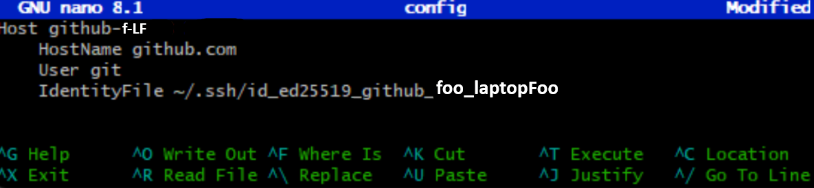  
 
Guardamos con `ctrl + o` y `enter`.   

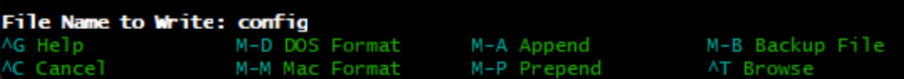  

Salimos con `ctrl + x`.

Verificamos la conexión con `ssh -T git@github-f-LF` y escribimos `yes` cuando se solicite confirmar la identidad del host por primera vez.  
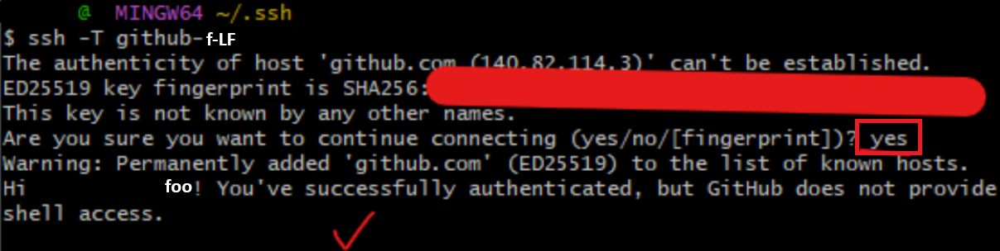  

El mensaje `... does not provide shell access` es el esperado.
## Configuración local de SSH para un proyecto
### 4. Cambiar el remote del proyecto  

Entramos a **VS Code** o al IDE donde está el repositorio local. En la terminal ejecutamos `git remote set-url origin git@alias_host:dueño_repo/repositorio.git`.  
Después ejecutamos `git remote -v` para verificar que se configuró correctamente.  

>[!NOTE]  
>El **remote** es la configuración que informa a Git a qué repositorio remoto debe enviar y de cuál debe recibir los cambios.

### 5. Configurar la identidad local del repositorio  

```bat
git config user.name "Nombre Cuenta Secundaria"  
git config user.email "correo_secundario"
```  
>[!NOTE]  
>Estas opciones establecen la autoría de los commits futuros en este repositorio.
>
>Si se desea ocultar el correo real, se recomienda usar exactamente la dirección `noreply` proporcionada por GitHub en `Settings → Emails`. Para que GitHub atribuya los commits a la cuenta correcta, se debe usar esa dirección o un correo añadido a dicha cuenta.

 
### 6. Verificar commits mediante firma SSH (insignia Verified) (opcional)

La insignia *Verified* es la que se muestra en GitHub:  
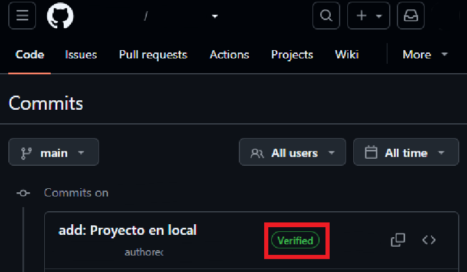
#### Creación y configuración en Git Bash
Primero debemos añadir la clave pública a GitHub como *Signing key*. Podemos usar la misma clave de autenticación, pero debemos subirla una segunda vez y seleccionar el tipo de clave correspondiente, como se indicó en el paso 2.  

Segundo, si también queremos verificar las firmas localmente, creamos el archivo `allowed_signers` y configuramos Git para reconocerlo. Este archivo no interviene en la insignia *Verified* de GitHub; funciona únicamente como almacén local de claves confiables.

Abrimos **Git Bash**: 
```bash
touch ~/.ssh/allowed_signers
git config --global gpg.ssh.allowedSignersFile ~/.ssh/allowed_signers
``` 

Tercero, buscamos si la clave ya está registrada comparando sus datos, sin depender del comentario final.  

```bash
key_data="$(awk '{print $2}' ~/.ssh/id_ed25519_github_foo_laptopFoo.pub)"
grep -Fq "$key_data" ~/.ssh/allowed_signers  
echo $?  
```


> `0`: ya existe un registro.  
> `1`: no existe un registro.

Cuarto, si existe un duplicado debido a un error previo, lo eliminamos.

```bash
nl ~/.ssh/allowed_signers  
```
Identificamos el número que en este caso es 1.  

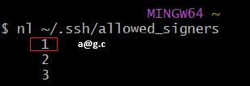

Y lo eliminamos con:
```bash
sed -i '1d' ~/.ssh/allowed_signers
```
En este comando, `1` es el número de línea y `d` es la orden de eliminación.

Después, verificamos con:
```bash
cat ~/.ssh/allowed_signers
```

Quinto, creamos un nuevo registro.   
Debemos seguir el formato `<principal> <tipo_clave> <clave_base64> [comentario]`:
- El **principal** será el correo de la cuenta que firmará los commits, el mismo que se configuró mediante `git config user.email` en el paso 5.
- El **tipo de clave** y la **clave** se pueden obtener con `cat ~/.ssh/id_ed25519_github_foo_laptopFoo.pub`, omitiendo el comentario del final. 
- El **comentario** es opcional y puede ser únicamente el nombre del dispositivo.  

Por último, juntamos todo en el siguiente comando:
```bash
echo "principal tipo_clave clave comentario" >> ~/.ssh/allowed_signers  
```
Ejemplo: 
```bash
echo "a@g.c ssh-ed25519 ABC laptopFoo" >>  ~/.ssh/allowed_signers
```

Verificamos el resultado con `cat ~/.ssh/allowed_signers`.
#### Configuración en el repositorio
En **VS Code** u otro IDE, desde el directorio principal del repositorio, ejecutamos en CMD o Git Bash:

```bash
git config commit.gpgsign true  
git config gpg.format ssh  
git config user.signingkey ~/.ssh/id_ed25519_github_foo_laptopFoo.pub
```  

Para verificar la firma, ejecutamos: 
```bash
git commit --allow-empty -m "test ssh signing"  
git log --show-signature -1
```  
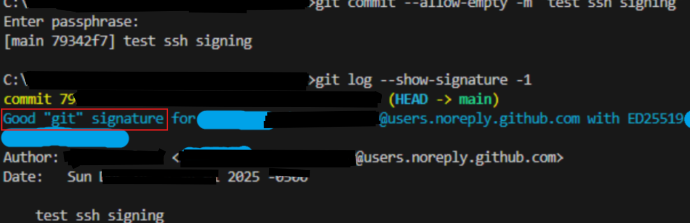

```bash
git push  
```

Después la verificamos en la interfaz de GitHub.  

### 7. Introducir la passphrase una única vez por sesión

Para agilizar el proceso de desarrollo, podemos iniciar un agente y añadir la clave. Solo tendremos que introducir la passphrase una vez durante esa sesión de Git Bash. Para evitar escribir manualmente las rutas, podemos copiarlas desde la terminal y desde el archivo de configuración.

```bash
pwd | clip
# Copiar la ruta del repositorio actual al portapapeles.

cd ~/.ssh
nano config
# Copiar el valor de IdentityFile correspondiente a la cuenta.

cd "<ruta_del_repositorio_copiada>"
# Sustituir el texto entre ángulos pegando la ruta con Windows + V.

eval "$(ssh-agent -s)"
# Iniciar un agente

ssh-add IdentityFile_copiado
# Sustituir IdentityFile_copiado pegando el valor copiado desde config.

# Introducir la passphrase

# Ahora se podrán crear commits firmados y enviar cambios sin volver a
# introducir la passphrase durante esta sesión.
```

### 8. Configurar un alias en Git

Para continuar agilizando el desarrollo, podemos configurar un alias que prepare los archivos, cree un commit y envíe los cambios.

En **Git Bash**:

```bash
git config --global alias.acp '!git add . && git commit && git push' 

# Verificar con 
git config --get-regexp '^alias\.'

# Para eliminarlo 
git config --global --unset alias.acp
```

Para los mensajes de commit se recomienda seguir este formato:

* Primera línea = título 
* Espacio en blanco
* Descripción detallada (opcional)

Antes de ejecutar `git acp`, conviene revisar `git status`, ya que `git add .` puede incluir archivos que no se pretendía registrar.

# Flujo diario en una cuenta y un repositorio ya configurados  

1. Abrir el repositorio en VS Code.
1. Abrir una instancia de Git Bash integrada.
1. Ejecutar las instrucciones del [paso 7](#7-introducir-la-passphrase-una-única-vez-por-sesión) para iniciar el agente y añadir la clave.
4. Realizar los cambios y enviarlos.

```bash
git acp
```

5. Si no se sabe si el agente continúa activo después de un periodo de inactividad:
```bash
ssh-add -l > /dev/null 2>&1
case $? in
    0) echo "Agente activo con al menos una clave cargada." ;;
    1) echo "Agente accesible, pero no se listaron claves." ;;
    2) echo "No se pudo contactar al agente." ;;
esac
# Comprueba el estado sin mostrar el tipo, la huella ni el comentario.

ssh-add -D
# Si son incorrectas, eliminar todas las claves del agente.

eval "$(ssh-agent -k)"
# Detener el agente de la sesión actual.

# Volver al paso 7.
```
# Referencias

[1] GitHub. (n.d.). *Connecting to GitHub with SSH*. GitHub Docs. Retrieved May 28, 2026, from https://docs.github.com/en/authentication/connecting-to-github-with-ssh  

[2] GitHub. (n.d.). *About SSH*. GitHub Docs. Retrieved May 28, 2026, from https://docs.github.com/en/authentication/connecting-to-github-with-ssh/about-ssh  

[3] GitHub. (n.d.). _Checking for existing SSH keys_. GitHub Docs. Retrieved May 28, 2026, from https://docs.github.com/en/authentication/connecting-to-github-with-ssh/checking-for-existing-ssh-keys  

[4] GitHub. (n.d.). _Generating a new SSH key and adding it to the ssh-agent_. GitHub Docs. Retrieved May 28, 2026, from https://docs.github.com/en/authentication/connecting-to-github-with-ssh/generating-a-new-ssh-key-and-adding-it-to-the-ssh-agent  

[5] GitHub. (n.d.). _Adding a new SSH key to your GitHub account_. GitHub Docs. Retrieved May 28, 2026, from https://docs.github.com/en/authentication/connecting-to-github-with-ssh/adding-a-new-ssh-key-to-your-github-account?tool=webui  

[6] GitHub. (n.d.). _SSH commit signature verification_. GitHub Docs. Retrieved May 28, 2026, from https://docs.github.com/en/authentication/managing-commit-signature-verification/about-commit-signature-verification#ssh-commit-signature-verification  

[7] GitHub. (n.d.). _Telling Git about your SSH key_. GitHub Docs. Retrieved May 28, 2026, from https://docs.github.com/en/authentication/managing-commit-signature-verification/telling-git-about-your-signing-key#telling-git-about-your-ssh-key  

[8] GitHub. (n.d.). _Signing commits_. GitHub Docs. Retrieved May 28, 2026, from https://docs.github.com/en/authentication/managing-commit-signature-verification/signing-commits 

[9] GitHub. (n.d.). _Managing multiple accounts_. GitHub Docs. Retrieved July 20, 2026, from https://docs.github.com/en/account-and-profile/how-tos/account-management/managing-multiple-accounts

[10] GitHub. (n.d.). _Setting your commit email address_. GitHub Docs. Retrieved July 20, 2026, from https://docs.github.com/en/account-and-profile/how-tos/email-preferences/setting-your-commit-email-address

[11] OpenBSD. (n.d.). _ssh-add(1) — OpenBSD manual pages_. Retrieved July 20, 2026, from https://man.openbsd.org/ssh-add

# To review
## 1
**9\. extra: Pushing big datasets with LFS.**  
error  
**VSC**  
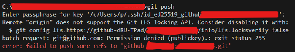

**Git bash**  
cd repo\_path

[https://docs.github.com/en/repositories/working-with-files/managing-large-files/configuring-git-large-file-storage](https://docs.github.com/en/repositories/working-with-files/managing-large-files/configuring-git-large-file-storage)   
1-3

git add lfs\_object (or git add .)  
git commit \-m “chore: add large file”

eval "$(ssh-agent \-s)"  
ssh-add IdentityFile (\~/.ssh/*id\_ed25519\_...*)  
cd repo\_path (if not done)  
git push

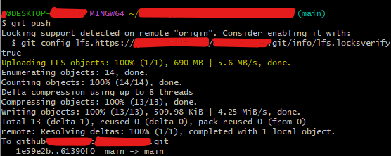

If you commit the .csv without lfs

git rm \-CACHED file  
git lfs migrate import \--include="evaluaciones/EA/Reviews.csv"  
git add .  
git commit \-m “foo”  
git push \--force-with-lease

## 2
12\.  
something rare happen with the GUI. It keeps asking me for the passphrase. i used commit and push option  
using GUI of VSC  
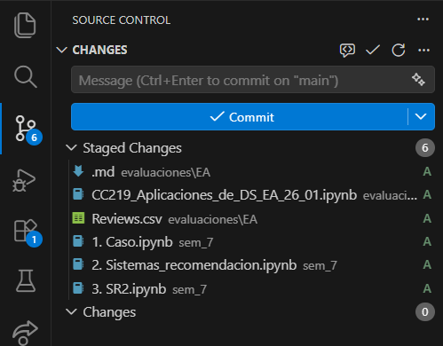


This is the standard Git commit format:

* first line \= title  
* blank line  
* detailed description (optional)
