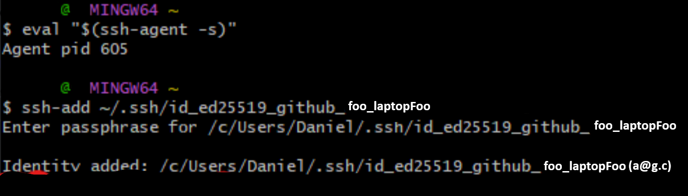

# Conexión a GitHub mediante SSH

El objetivo de esta guía es realizar commits y pushes desde una cuenta alternativa usando SSH. De modo que podamos utilizar nuestra cuenta principal en nuestro IDE para beneficiarnos de suscripciones de pago como GitHub Copilot Pro.  

# Cuenta con SSH en un Nuevo Repo  
Si ya se realizó esta configuración de la cuenta en `allowed\_signers` y se quiere usar dicha cuenta en un nuevo repo entonces únicamente seguir los pasos:
1.  [Recordar el alias del host](#4-configurar-sshconfig) (Paso 4).
1. [Configurar la identidad del autor en el IDE](#5-cambiar-el-remote-del-proyecto) (Paso 5).
1. [Configurar la identidad local del repo](#6-onfigurar-identidad-local-del-repo) (Paso 6).
1. [Configurar las firmas en el repositorio](#configuración-en-el-repositorio) (Paso 7, parte 2).
 
# Tutorial desde 0
## Configuración del SSH en un dispositivo
### 1. Crear una llave SSH  
Cada cuenta necesita una clave SSH por cada dispositivo que la use. Alternativamente, se puede crear un SSH por cuenta, pero existen riesgos de seguridad. En este caso optaremos por la primera opción.  

Abrimos **Git Bash** y corremos

```bash
ssh-keygen -t ed25519 -C "correo_de_la_cuenta_secundaria"
```
Luego de ello cambiamos el final de la ruta predeterminada (`id_...`) por el siguiente formato `id_<tipo>_<servicio>_<cuenta>_<dispositivo>`  
Donde el `<tipo>` es ed25519 y `<servicio>`, github.  
Ejemplo: 
`/c/Users/FFF/.ssh/id_ed25519_github_foo_laptopFoo`  


Generar un passphrase con 1Password, u otro password manager, de 30 de longitud . Y guardala en una carpeta llamada SSHs keys con una abreviación del nombre de la cuenta y también del dispositivo. Ejemplo: `f.LF ssh`  

Luego ingresarla en **Git Bash**.    


### 2. Agregar la llave al ssh-agent

Correr en **Git Bash**
```bash
eval "$(ssh-agent -s)"  
ssh-add ~/.ssh/id_ed25519_github_foo_laptopFoo 
```
  

Para verificar que el agente sigue activo, ejecutar `echo $SSH_AGENT_PID`. Donde PID es process ID. Y si  se quisiera eliminar, `ssh-agent -k`.

### 3. Añadir la clave pública a GitHub
Correr en **Git bash**  
```bash
cat ~/.ssh/id\_ed25519_github_foo_laptopFoo.pub | clip  
```  
Este comando copiará el texto necesario a tu clipboard.  
Luego ir a https://github.com/settings/keys o `GitHub website → Settings (account settings) → SSH and GPG keys → New SSH key`.
Pegar como *authentication key* y tal cuál se copió del `cat`.
  
Para simplificar el paso 7 (firma de commits) puedes ir añadiendo también la signing key cambiando el key type y colocando el mismo texto. Aunque ese paso es opcional.

### 4. Configurar ~/.ssh/config  

Abrir **Git bash**  
```bash
cd ~/.ssh  
nano config  
```  

Y colocar los host en este formato:

```bash
Host <service>-<abreviación_nombre_cuenta>-<abreviación_nombre_dispositivo> = Alias
    HostName github.com  
    User git  
    IdentityFile ~/.ssh/id_ed25519_github_foo_laptopFoo
```
Ejemplo del archivo:
```bash
Host github-f-LF  
    HostName github.com  
    User git  
    IdentityFile ~/.ssh/id_ed25519_github_foo_laptopFoo

Host n…  
    HostName github.com  
    User git  
    IdentityFile … 
…
```  
 
   
Para añadir más hosts basta con colocar los nuevos abajo.  
  
 
Guardamos con `ctrl + o` y `enter`.   

  

Salimos con `ctrl + x`.

Verifica con `ssh -T github-f-LF` y colocque `yes` cuando se pida.  
  

El mensaje `... does not provide shell access` es el esperado.
## Configuración del SSH en Local para un Proyecto
### 5. Cambiar el Remote del Proyecto  

Entrar a **VSC** o al IDE donde está el repositorio en local. En la CMD ejecutar `git remote set-url origin git@host_alias:dueño_repo/repositorio.git`.  
Y ejecutar `git remote -v`  para verificar que se ha colocado correctamente.  

>[!NOTE]  
>El **remote** es la configuración que informa a Git a qué repositorio remoto debe enviar y de cuál debe recibir los cambios.

### 6. Configurar identidad local del repo  

```bat
git config user.name "Nombre Cuenta Secundaria"  
git config user.email "correo_secundario"
```  
>[!NOTE]  
>Configurar esas opciones nos permiten modificar la autoría futura de los commits.

 
### 7. Verificar commits con SSH signing (verified badge) (Opcional)

El verified badge es el que se muestra en github:  

#### Creación y Configuración en Git Bash
Primero debemos crear una signing key de la misma forma que creamos la authentication key en el paso 3 pero cambiando el key type.  

Segundo, debemos crear la carpeta de allowed_signers y la configuramos para que git la reconozca.

Abrir **Git bash** 
```bash
touch ~/.ssh/allowed_signers
git config --global gpg.ssh.allowedSignersFile ~/.ssh/allowed_signers
``` 

Tercero, buscamos duplicados.  

```bash
grep -q "$(cat ~/.ssh/id_ed25519_github_foo_laptopFoo.pub)" ~/.ssh/allowed_signers  
echo $?  
```


>0 -> existe ya un registro  
>1 -> no existe

Cuarto, en caso haber un duplicado (por posible error previo) entonces lo eliminamos.

```bash
nl ~/.ssh/allowed_signers  
```
Identificamos el número que en este caso es 1.


y lo eliminamos con
```bash
sed -i '1d' ~/.ssh/allowed_signers
```
Donde 1 es la línea y d es el comando de delete.

Después, verificamos con
```bash
cat ~/.ssh/allowed_signers
```

Quinto, creamos un registro nuevo.   
Debemos seguir el formato de `<principal> <tipo_clave> <clave_base64> [comentario]`
- El **principal** será el email de la cuenta que firmará los commits. La misma que se configuró en `git config user.name` en el paso 6.
-  El **tipo clave** y la **clave** la podemos sacar con `cat ~/.ssh/id_ed25519_github_foo_laptopFoo.pub` y quitando el email del final. 
- El **comentario** es opcional y puede ser únicamente el nombre del dispositivo.  

Por último juntamos todo en el siguiente comando:
```bash
echo "email tipo_clave clave comentario" >> ~/.ssh/allowed_signers  
```
Ejemplo: 
```bash
echo "a@g.c ssh-ed25519 ABC laptopFoo" >>  ~/.ssh/allowed_signers
```

Verifica con `cat ~/.ssh/allowed_signers`
#### Configuración en el repositorio
En **VSC** u otro **IDE** en el directorio principal en CMD o Git Bash ejecutar:

```bash
git config commit.gpgsign true  
git config gpg.format ssh  
git config user.signingkey ~/.ssh/id_ed25519_github_foo_laptopFoo.pub
```  

Para **verificar** ejecutar 
```bash
git commit --allow-empty -m "test ssh signing"  
git log --show-signature-1
```  


```bash
git push  
```

Y verificarlo en la UI de GitHub.  

### 8. Colocar el Passphrase una Única Vez por Sesión

Para acelerar el proceso de desarrollo podemos configurar un agente para que solo coloquemos el passphrase una vez por sesión.

```bash
pwd | clip
# Copiar en el clipboard

cd ~/.ssh
nano config
# Copiar el IdentityFile

cd {copied pwd}
# windows + v para abrir el clipboard

eval "$(ssh-agent -s)"
# Iniciar un agente

ssh-add IdentityFile # ~/.ssh/...
# Añadir el identificador

# Colocar la contraseña

# Ahora ya se podrá ejecutar los commits y pushes sin necesidad de ingresar el passphrase
```

### 9. Configurar un Alias en Git

Para continuar agilizando el desarrollo, podemos configurar un alias de staging, committing y pushing.

En **Git bash**

```bash
git config --global alias.acp '!git add . && git commit && git push' 

# Verificar con 
git config --get-regexp '^alias\.'

# Para eliminarlo 
git config --global --unset alias.acp
```

Para commits seguir el siguiente formato:

* Primera línea = título 
* Espacio en blanco
* Descripción detallada (opcional)

# Workflow Diaro en una Cuenta y Repo ya Configurados  

1. Abrir el repo en VSC
1. Abrir una instancia de Git Bash integrada.
1. Ejecutar y seguir estas instrucciones:
```bash
pwd | clip
# Copiar en el clipboard

cd ~/.ssh
nano config
# Copiar el IdentityFile

cd {copied pwd}
# windows + v para abrir el clipboard
```
4. Instanciar el agente
```bash
eval "$(ssh-agent -s)"
ssh-add IdentityFile # ~/.ssh/...
# Colocar la contraseña
```
5. Realizar los cambios y pushear.

```bash
git acp
```

6. Si no se está seguro que el agente está activo por haber estado mucho tiempo ausente:
```bash
echo $SSH_AGENT_PID
# Verificar si un Agente Existe

echo ssh-add -l
# En caso no estar seguro de ser el correcto, verificarlo por email o clave.

ssh-add -D
# Si es erróneo, eliminar las llaves

eval "$(ssh-agent \-k)"
# Eliminar el agente

# Volver al paso 4
```
# Sources

[1] GitHub. (n.d.). *Connecting to GitHub with SSH*. GitHub Docs. Retrieved May 28, 2026, from https://docs.github.com/en/authentication/connecting-to-github-with-ssh  

[2] GitHub. (n.d.). *About SSH*. GitHub Docs. Retrieved May 28, 2026, from https://docs.github.com/en/authentication/connecting-to-github-with-ssh/about-ssh  

[] Github. (n.d.). _Checking for existing SSH keys_. GitHub Docs. Retrieved May 28, 2026, from https://docs.github.com/en/authentication/connecting-to-github-with-ssh/checking-for-existing-ssh-keys  

[] Github. (n.d.). _Generating a new SSH key and adding it to the ssh-agent_. GitHub Docs. Retrieved May 28, 2026, from https://docs.github.com/en/authentication/connecting-to-github-with-ssh/generating-a-new-ssh-key-and-adding-it-to-the-ssh-agent  

[] Github. (n.d.). _Adding a new SSH key to your GitHub account_. GitHub Docs. Retrieved May 28, 2026, from https://docs.github.com/en/authentication/connecting-to-github-with-ssh/adding-a-new-ssh-key-to-your-github-account?tool=webui  

[] Github. (n.d.). _SSH commit signature verification_. GitHub Docs. Retrieved May 28, 2026, from https://docs.github.com/en/authentication/managing-commit-signature-verification/about-commit-signature-verification#ssh-commit-signature-verification  

[] Github. (n.d.). _Telling Git about your SSH key_. GitHub Docs. Retrieved May 28, 2026, from https://docs.github.com/en/authentication/managing-commit-signature-verification/telling-git-about-your-signing-key#telling-git-about-your-ssh-key  

[] Github. (n.d.). _Signing commits_. GitHub Docs. Retrieved May 28, 2026, from https://docs.github.com/en/authentication/managing-commit-signature-verification/signing-commits 

# To review
## 1
**9\. extra: Pushing big datasets with LFS.**  
error  
**VSC**  


**Git bash**  
cd repo\_path

[https://docs.github.com/en/repositories/working-with-files/managing-large-files/configuring-git-large-file-storage](https://docs.github.com/en/repositories/working-with-files/managing-large-files/configuring-git-large-file-storage)   
1-3

git add lfs\_object (or git add .)  
git commit \-m “chore: add large file”

eval "$(ssh-agent \-s)"  
ssh-add IdentityFile (\~/.ssh/*id\_ed25519\_...*)  
cd repo\_path (if not done)  
git push


If you commit the .csv without lfs

git rm \-CACHED file  
git lfs migrate import \--include="evaluaciones/EA/Reviews.csv"  
git add .  
git commit \-m “foo”  
git push \--force-with-lease

## 2
12\.  
something rare happen with the GUI. It keeps asking me for the passphrase. i used commit and push option  
using GUI of VSC  


This is the standard Git commit format:

* first line \= title  
* blank line  
* detailed description (optional)